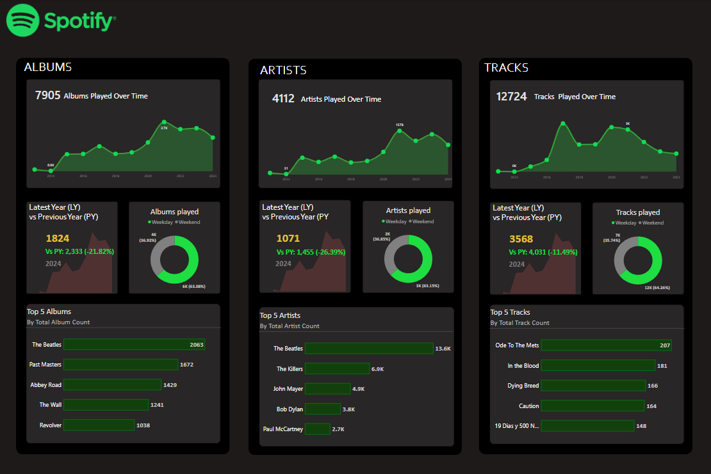

# Spotify Listening Trends Dashboard (2014–2024)
## Tools Used: 
-Power BI
-Excel
-Power Query

## Key Features:

-Interactive dashboard showcasing trends in albums, artists, and tracks played over a 10-year span

-Dynamic KPI cards highlighting year-over-year comparisons

-Visual breakdown of weekday vs weekend listening behavior

-Ranked charts of top 5 albums, artists, and tracks by play count

## Insights Extracted:

-Peak listening activity occurred in 2020 and 2022 across all categories

-The Beatles emerged as the most played artist and album contributor

-Weekends accounted for the majority of listening time

-Notable drop in new artist and track discoveries in 2024
## Preview

